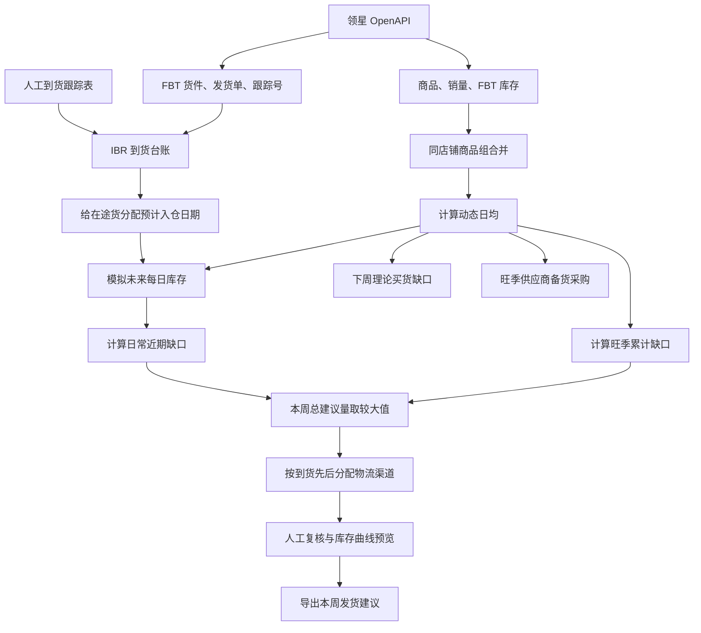
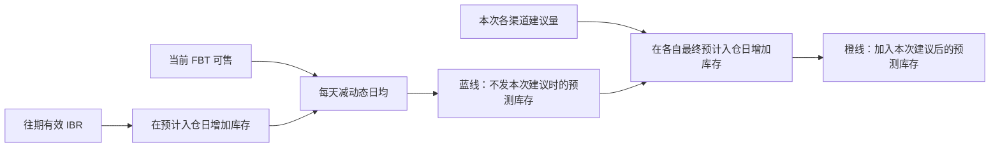

# TK 发货与旺季备货决策台：完整业务逻辑

## 1. 系统要解决什么问题

这个项目把“库存、在途、销量、旺季目标、物流时间”放到同一条时间线上，帮助业务每周做两类决定：

- **发货决定**：本周从国内发多少货，并分别走哪些物流渠道。
- **买货决定**：下周理论上还需要向供应商购买多少货。

此外还有一张独立的旺季采购表，用来估算从当前月份以后整段旺季还需要准备的毛需求。

发货和买货不能只看一个库存总数。系统还必须知道货什么时候到，因为“一个月后会到的 100 件”无法解决“下周就断货”的问题。

## 2. 全流程



## 3. 关键名词

### 3.1 动态日均

动态日均是系统对“现在每天大约能卖多少件”的估计。

默认公式：

```text
动态日均 D
= 近7天日均 × 50%
+ 近14天日均 × 30%
+ 近30天日均 × 20%
```

三个权重可以在参数页调整，但合计必须是 100%。

短周期权重更高，因此近期销量上涨或下跌会更快反映到建议量中；长周期仍保留一部分权重，用于减少单日波动。

注意：

- 销量窗口截至运行日前一天。
- 当前断货商品的销量可能被库存不足压低，系统会提示风险。
- 当前没有逐日可售库存历史，因此系统不能自动、精确地剔除所有断货日并还原真实需求。

### 3.2 三个 FBT 库存字段

| 字段 | 含义 | 在计算中的作用 |
|---|---|---|
| FBT 库存 | 已进入 FBT 仓的总库存 | 进入总库存账 |
| FBT 可售 | 当前真正可以卖的库存 | 用于推算最近断货日 |
| FBT 在途 | 已发往 FBT、尚未全部入仓的总量 | 进入总库存账，但必须由 IBR 给出时间节点才能抬高曲线 |

必须区分“总量”和“时间”：

- FBT 在途回答“总共有多少货在路上”。
- IBR 到货台账回答“这些货预计哪一天入仓”。
- 同一批在途不能既按 FBT 在途加一次，又按 IBR 再加一次。

### 3.3 IBR

IBR 是 FBT 货件编号。系统保存每个货件的：

- 发货数量、签收数量、接收数量和未接收数量。
- 发货日、开船日、到港/签收日、预计 FBT 入仓日、实际接收日。
- 承运商、物流渠道和跟踪号。
- 每个商品在该货件中的数量。

只有满足以下条件的 IBR 才进入未来库存曲线：

1. 尚未全部接收；
2. 有未来预计入仓日；
3. 预计入仓日早于停止收货日；
4. 不是历史归档记录。

已逾期货件保留预警，但不会继续假定它会按过去的日期入仓。

### 3.4 商品组与执行 MSKU

同一店铺内，如果两个 MSKU 只在末尾相差 `-US`，系统将它们视为同一个商品：

```text
CJX0265-4
CJX0265-4-US
```

合并时会把以下数据相加：

- 7/14/30 天销量及日均；
- FBT 库存、FBT 可售、FBT 在途；
- TikTok 可用库存和待出库；
- 两个 MSKU 对应的有效 IBR。

系统只计算一次建议，避免重复发货。不同店铺不会自动合并。

“执行 MSKU”是最终在页面和导出表中使用的代表编号。系统优先选择：

1. 仍在售；
2. 有销量；
3. 销量更高；
4. `-US` 成员；
5. 库存更多。

业务也可以在商品详情中手动指定执行 MSKU。

## 4. 每周计划日期

旺季时间表中的每一行代表一个周一发货批次。

- 周一运行：计算当天这批发货。
- 周二至周日运行：计算下一个周一要执行的发货。
- “本周发货”指当前要准备执行的最近周一批次。
- “下周买货”指本次发货之后，用下一张旺季时间表目标测算的理论缺口。

默认旺季时间表：

| 计划周一 | 旺季基础覆盖天数 |
|---|---:|
| 2026-06-22 | 25.5000 |
| 2026-06-29 | 44.0000 |
| 2026-07-06 | 62.5000 |
| 2026-07-13 | 81.0000 |
| 2026-07-20 | 99.5000 |
| 2026-07-27 | 111.6250 |
| 2026-08-03 | 123.7500 |
| 2026-08-10 | 135.8750 |
| 2026-08-17 | 148.0000 |
| 2026-08-24 | 160.1250 |
| 2026-08-31 | 165.5625 |
| 2026-09-07 | 171.0000 |
| 2026-09-14 | 176.4375 |
| 2026-09-21 | 181.8750 |
| 2026-09-28 | 187.3125 |
| 2026-10-05 | 192.7500 |

这里的“旺季基础覆盖天数”不是物流时效，也不是每次额外再发这么多天的货。它表示：**截至这一批计划执行后，库存总账应累计覆盖多少个“当前日均销售日”。**

时间表是业务计划，动态日均是每周更新的尺子。因此天数不变时，目标件数仍会随销量变化：

```text
本周旺季目标件数
= 动态日均 × 本周旺季总覆盖天数
```

## 5. 物流渠道

默认渠道如下：

| 渠道 | 默认运输时效 | 船期 |
|---|---:|---|
| 快递 IP | 3–4 个自然日 | 无固定截单/开船 |
| 空派 IE | 7–9 个自然日 | 无固定截单/开船 |
| 快船 | 开船后 12–19 个自然日 | 周六截单、周三开船 |
| 普船卡派 | 开船次日起 15–18 个自然日 | 默认周六截单、周四开船 |
| COSCO 慢船 | 开船后 22–25 个自然日 | 周六截单、周四开船 |

系统采用每个时效范围的**最慢值**进行保守计算。

每条渠道都可以独立设置：

- 是否参与新建议；
- 最快和最慢运输时效；
- 安全天数；
- 发货频率；
- 海运渠道的截单星期和开船星期。

至少必须启用一条常规渠道：快船、普船卡派或慢船。

### 5.1 固定“安全 + 频率”模式

```text
最终预计入仓日
= 计划发货日
+ 最慢运输时效
+ 安全天数
+ 发货频率
```

这个模式不寻找真实船期，把“多久发一次”直接当作额外等待风险。

### 5.2 精准船期模式

对快船、普船卡派和慢船：

```text
最终预计入仓日
= 最近能赶上的开船日
+ 最慢运输时效
+ 安全天数
```

系统先根据计划发货日寻找最近截单日，再找到截单后的开船日。真实等待船期已经替代“发货频率”，因此海运不会再重复加一次频率。

对没有固定船期的快递和空派，两种模式都使用：

```text
最终预计入仓日
= 计划发货日
+ 最慢运输时效
+ 安全天数
+ 发货频率
```

系统不再单独增加“签收后 FBT 入库 2 天”，这段风险已经包含在安全天数里。

## 6. 断货风险怎样计算

断货模拟从当前 FBT 可售开始：

```text
每天期末库存
= 前一天库存
+ 当天预计入仓的有效 IBR
- 动态日均
```

库存第一次小于或等于 0 的日期就是预计断货日。

因此，断货风险只由以下三件事决定：

1. 当前 FBT 可售；
2. 动态日均；
3. 往期有效 IBR 的预计入仓日期和数量。

启用或关闭快递、空派不会改变“原本会不会断货”，只会改变系统能否使用更快渠道补救。

## 7. 本周一共建议发多少

系统分别计算两种缺口，然后取较大值。

### 7.1 日常近期缺口

它回答：

> 按最快启用的常规渠道最终入仓日来看，现有库存和此前会到的 IBR 是否足够？

设：

- `D`：动态日均；
- `L`：最快启用常规渠道的最终预计入仓天数；
- `C`：FBT 已入仓库存；
- `U`：已执行但尚未同步到领星的数量；
- `R(L)`：在 `L` 天窗口内预计入仓的有效 IBR。

公式：

```text
日常近期目标 = D × L

日常近期可用 = C + U + R(L)

日常近期缺口
= max(0, 日常近期目标 - 日常近期可用)
```

这部分使用有日期的 IBR，因为只有在目标窗口内到达的货才能解决近期问题。

### 7.2 旺季累计缺口

它回答：

> 执行完本周发货后，总库存账是否达到本周旺季累计目标？

设：

- `B`：时间表中的本周旺季基础覆盖天数；
- `S`：承接旺季尾货的最晚启用常规渠道安全天数；
- `F`：该渠道在当前模式中实际采用的频率天数；精准船期模式下海运为 0；
- `T`：FBT 在途总量。

公式：

```text
本周旺季总覆盖天数 = B + S + F

本周旺季目标 = D × 本周旺季总覆盖天数

库存总账 = FBT库存 + FBT在途 + 已执行未同步

旺季累计缺口
= max(0, 本周旺季目标 - 库存总账)
```

这里使用 FBT 在途总量而不再次添加 IBR。IBR 只是把这笔在途总量放到具体日期上。

### 7.3 本周总建议量

```text
本周总建议量
= max(日常近期缺口, 旺季累计缺口)
```

这样既不会只顾远期旺季而忽略近期断货，也不会只补眼前几天而落后于整段旺季目标。

## 8. 总建议量如何分给渠道

系统不是按固定比例拆分，而是按“谁先到、要撑到什么时候”进行接力。

### 8.1 候选渠道

渠道必须同时满足：

1. 已在参数页启用；
2. 最终预计入仓日早于停止收货日；
3. 快递或空派必须比最快常规渠道更早到，才有紧急桥接价值。

如果两个渠道在同一天入仓，只保留优先级更高的渠道，避免没有时间价值的重复拆分。默认优先级：

```text
快递 > 空派 > 快船 > 普船卡派 > COSCO慢船
```

### 8.2 桥接量

渠道按最终预计入仓日从早到晚排序。

较早渠道不需要承接整段旺季，只负责让库存从“自己到达”撑到“下一条渠道到达前一天”，并保留自己的安全库存。

概念公式：

```text
较早渠道桥接量
= 在自己到达日至下一渠道到达日前，
  为保证库存始终不低于安全库存所需的最大缺口
```

计算时会考虑：

- 当前 FBT 可售；
- 每日动态日均扣减；
- 这段时间会到的往期 IBR；
- 已经安排的更早渠道数量；
- 当前渠道自己的安全天数。

最后一条仍能在停止收货日前入仓的渠道承接剩余旺季数量。

这意味着：如果快船与慢船之间会断货，快船会被分配足够的桥接量，而不是只补到快船到达当天。

紧急桥接量有时会高于原旺季总缺口。系统允许提高本次总建议量，因为避免渠道之间断货优先于维持原来的总量上限。

### 8.3 停止收货日

停止收货日不是图上的装饰线，而是硬约束：

- 某渠道预计入仓日晚于或等于停止收货日，该渠道不再承接新建议。
- 原本应给它的数量会尝试前移到更早渠道。
- 如果所有启用渠道都来不及，系统显示“停止收货日阻断量”。

## 9. 下周理论买货缺口

在本周建议全部安排以后，系统使用时间表的下一周目标计算：

```text
下周理论买货缺口
= max(
    0,
    下周旺季目标
    - 当前库存总账
    - 本周各渠道建议量
  )
```

它是“下一周还缺多少”的短期理论值，不等于已生成采购订单，也没有扣供应商未到或历史采购。

## 10. 人工复核

商品详情允许人工修改各渠道最终发货量和买货量。

人工复核还支持建立“情景发货节点”。每个节点包含：

- 计划发货日；
- 物流渠道；
- 最终预计 FBT 入仓日；
- 本节点发货数量。

同一物流渠道可以添加多次，例如本周发一批快船、下周再发一批快船。新增节点后，系统会根据该节点的计划发货日和渠道参数计算预计入仓日；业务也可以直接覆盖预计入仓日。

节点的日期或渠道发生变化后，后端会重新计算：

1. 最早节点入仓前的日常近期缺口；
2. 本周旺季累计缺口；
3. 所有节点之间的桥接量；
4. 每个节点应承担的数量；
5. 调整后的下周理论买货缺口；
6. 停止收货日阻断量。

### 10.1 人工数量是固定条件，不是普通预览

人工修改某个节点的数量后，该数量会自动标记为“人工固定量”。系统不能再改动这个节点，只能调整其他未固定节点来迎合它：

- 人工调低：其他批次自动增加；现有批次赶不上断货点时，可以自动新增一条启用渠道作为接力，同一渠道允许跨批次重复。
- 人工调高：其他批次自动减少，避免旺季目标之外的冗余发货。
- 取消“固定此数量”：该节点重新交给系统自由分配。
- 人工固定量本身已经超过必要总量：其余节点会降到维持不断货所需的最小值，但系统不会擅自削减人工固定量。

所有数量调整共用一条逐日库存守恒公式：

```text
第 t 日预计库存
= 当前 FBT 可售
  + 截至第 t 日预计入仓的往期有效 IBR
  + 截至第 t 日入仓的人工固定批次
  + 截至第 t 日入仓的系统可调批次
  - 动态日均 × t
```

求解必须同时满足：

```text
人工节点数量 = 人工输入量
每个未锁定节点数量 >= 0
目标期间内每天预计库存 >= 0
总发货量 >= 本周应完成的目标缺口
```

在满足以上条件后，系统按以下顺序选择方案：

1. 总发货量尽量少；
2. 优先调整页面上已经存在的批次；
3. 能按时到达时，优先使用更晚、更慢的渠道，减少加急货；
4. 只有现有批次赶不上断货点时，才自动新增接力节点。

如果最快启用渠道到达前就会断货，重新分配在数学上无法消除这段缺口。系统会显示最早断货日期和仍缺数量，不会错误地显示“预计不断货”。

保存复核后，节点明细、人工固定状态和各渠道汇总数量会同时写入数据库；再次打开商品时，图表按照保存的多个节点恢复。

保存的复核结果带有一份“计算口径签名”，包括：

- 启用渠道；
- 时效计算模式；
- 计划发货日；
- 本周旺季覆盖天数；
- 停止收货日；
- 各渠道预计入仓日、安全天数和实际频率。

如果这些关键参数发生变化，旧复核结果不会继续冒充当前有效结果，商品会重新回到待复核状态。

修改数量后，后端自动重算其余节点，库存预测橙线和各渠道到货节点同步刷新；保存后才写入数据库。

### 10.2 三种复核状态与正式生效数量

人工方案保存以后不一定立即覆盖系统建议。三种状态的含义如下：

| 状态 | 是否保存节点 | 是否恢复草稿曲线 | 是否覆盖首页和导出 | 业务含义 |
|---|---:|---:|---:|---|
| 待复核（草稿） | 是 | 是 | 否 | 仍在讨论或调整 |
| 已复核（导出生效） | 是 | 是 | 是 | 数量已经确认，等待执行 |
| 已执行（已发货） | 是 | 是 | 是 | 该方案已经实际发出 |

系统保留“系统原始建议”和“正式生效建议”两个口径：

```text
某渠道正式生效量
= 如果复核状态为已复核/已执行且计算口径仍匹配：人工确认量
  否则：系统原始建议量

正式生效总发货量
= 所有启用渠道正式生效量之和
```

因此：

- 待复核节点会保存并在重新打开商品时恢复，但正式列表和 Excel 仍使用系统量；
- 已复核或已执行以后，首页汇总、渠道建议列、库存曲线和 Excel 使用人工方案；
- 修改渠道开关、物流时效、计算模式、计划发货日、旺季覆盖天数或停止收货日后，旧复核签名失效，系统重新使用当前参数计算并要求再次复核；
- 已复核和已执行当前采用相同的数量公式，区别是业务状态；“已执行”不会自动把节点转换成领星在途。

下周买货的正式口径同步使用人工发货量：

```text
人工最终买货量已确认时：
正式买货量 = 人工最终买货量

否则：
正式理论买货缺口
= max(0, 下周目标 - 当前库存总账 - 正式生效总发货量)
```

### 10.3 降低某个节点后怎样自动接力

用户修改节点数量时，前端会立即把该节点标记为“人工固定量”，并调用后端重新分配。后端的执行顺序是：

1. 重新读取当前 FBT 可售、动态日均和有日期的往期 IBR；
2. 固定所有人工锁定节点，系统不能修改其数量；
3. 逐日计算预计库存，找到第一个小于 0 的断货缺口；
4. 筛选预计入仓日不晚于该缺口、且早于停止收货日的候选节点；
5. 为可行节点增加刚好填平缺口的数量，然后继续向后逐日检查；
6. 时间线不断货后，如果总量仍低于本周目标，将剩余目标分给较晚、较慢且仍有效的节点。

候选节点来自：

```text
当前计划发货日
页面中已经存在的其他发货日
以上每个发货日 + 一个复核周期（通常7天）
```

系统会为这些发货日组合所有已启用渠道，并使用渠道设置计算最终预计入仓日。只有最终分到正数的隐藏候选才显示为“系统自动接力”节点。

多个候选都能及时到达时，选择顺序是：

1. 优先使用页面上已经存在的非自动节点；
2. 在仍能防止断货的前提下，优先更晚到达的节点；
3. 到达能力相同时，优先更慢的渠道，减少不必要的加急量。

这套逻辑会自动判断断货点、渠道和补足数量，也会生成本周或下一复核周期的发货节点；但它不会从所有任意日期中直接求出理论最晚发货日：

```text
理论最晚发货日
= 预计断货日
  - 最慢运输时效
  - 安全天数
  - 频率或等船时间
```

如果所有启用渠道都无法在断货前入仓，系统保留人工固定量并明确返回最早断货日期和仍缺数量，不会虚假显示为安全。

还要注意：人工调低一个渠道不等于主动降低本周总目标。算法仍要求完成“近期防断货”和“旺季累计目标”中的较大值，因此减少的数量通常会转移到其他节点。要降低总目标，需要调整动态日均、旺季覆盖天数或业务目标，而不是只降低某一条渠道。

## 11. 库存预测图



- **蓝线**：当前 FBT 可售，减去未来销量，并加入已有有效 IBR。
- **橙线**：在蓝线基础上，再加入本次建议。
- **到货节点**：往期 IBR 和本次建议在预计入仓日带来的库存跳升。
- **断货节点**：曲线首次跌到 0 或以下。
- **安全库存线**：动态日均 × 最快常规渠道安全天数。
- **停止收货线**：新建议允许入仓的最后边界。

图表展示的是设置后的最终预计入仓日，不是只显示纯运输时效。

## 12. IBR 到货台账与自动对账

领星接口数据和人工到货表会共同沉淀到 SQLite。

### 12.1 日期优先级

预计 FBT 入仓日按以下优先级选择：

1. 货件人工覆盖日期；
2. 导入表中明确的预计/实际接收日期；
3. 导入表中的到港或签收日期；
4. 领星货件预计到货日期；
5. 领星发货单预计到货日期。

系统不会再自动给表格到港日期增加或减少 2 天。

### 12.2 SKU 对账顺序

1. 已人工确认的别名；
2. 精确 MSKU；
3. 精确平台 SKU；
4. 仅去掉指定后缀后能够唯一匹配；
5. 无法唯一识别时进入待对账。

商品名称只用于人工辅助，不会仅凭名称相近自动合并。

同店铺内末尾 `-US` 商品组会共享 IBR 时间线。

### 12.3 防止在途重复计算

领星的 FBT 在途是总账，IBR 明细可能因为旧货件状态未及时更新而大于总账。

系统会把有日期的 IBR 明细按比例缩放，使进入预测时间线的合计不超过当前 FBT 在途总量。没有日期的剩余在途只留在总账中，不会提前抬高某一天的库存曲线。

## 13. 产品状态

每个商品组可标记为：

- 正常补货；
- 清仓；
- 下架。

清仓和下架商品仍保留销量、库存和 IBR 数据，但以下结果全部归零：

- 各物流渠道建议量；
- 下周买货缺口；
- 旺季备货采购建议；
- 汇总及发货建议导出。

`-US` 商品组中任一成员的状态变更会同步到整个商品组。

## 14. 独立旺季供应商备货采购

这张表回答的是：

> 从当前月份以后，整段旺季还应向供应商准备多少毛需求？

它与每周 FBT 发货建议是两套用途：

- 发货建议决定“现有货怎么走、什么时候入仓”。
- 备货采购决定“供应商还要准备多少生产量”。

月份倍率：

| 月份 | 倍率 | 等效销售天数 |
|---|---:|---:|
| 7 月 | 1.000 | 30.00 |
| 8 月 | 1.000 | 30.00 |
| 9 月 | 1.500 | 45.00 |
| 10 月 | 1.500 | 45.00 |
| 11 月 | 2.250 | 67.50 |
| 12 月 | 3.375 | 101.25 |
| 合计 | 10.625 | 318.75 |

已完成月份会从总天数中扣除。例如 7 月已经完成：

```text
剩余旺季等效天数 = 318.75 - 30 = 288.75 天
```

计算公式：

```text
采用日均 = 默认动态日均或人工修改日均

系统备货量
= 向上取整(
    采用日均 ×
    (剩余旺季等效天数 + 人工增加天数)
  )
```

业务还可以直接覆盖最终备货量。

当前版本按已确认的简化口径计算毛需求：

- 不扣 FBT 库存；
- 不扣 FBT 在途；
- 不扣以前已经买过的数量；
- 不处理重复采购；
- 不使用 ROI、MOQ 或箱规；
- 动态日均为 0 的商品不显示。

## 15. 导出结果

### 15.1 发货建议

每个商品组只导出一行，包括：

- 品名和执行 MSKU；
- 7/14/30 天日均；
- 动态日均；
- FBT 库存、FBT 可售、FBT 在途；
- 安全天数和发货频率；
- 每条启用渠道的覆盖天数；
- 每条启用渠道的建议量。

停用渠道不会出现在页面建议列和导出列中。

导出使用“正式生效数量”：

- 待复核草稿仍导出系统原始建议；
- 已复核和已执行导出人工确认后的渠道合计；
- 同一渠道存在多个发货日期时，Excel 将这些节点汇总成一个渠道总量，不展开批次日期；
- 不同日期的执行明细仍以商品详情中的发货节点为准。

### 15.2 到货跟踪

导出文件可继续维护并再次导入，包含：

- 到货跟踪主表；
- 系统对账标识；
- 匹配状态和异常信息；
- 货件及商品明细。

相同文件重复导入使用文件哈希去重，不会重复创建记录。

### 15.3 旺季备货

供应商备货表只保留：

```text
SKU
品名
备货量
```

## 16. 当前明确不做的事情

- 不根据 ROI 改变补货量。
- 不读取本地仓或供应商未到数据。
- 不做 MOQ、箱规和整箱取整。
- 不自动扣减历史采购，重复购买由业务暂时人工控制。
- 不根据商品名称模糊匹配 SKU。
- 不自动访问 UPS/FedEx 官网追踪接口；跟踪号缺失时人工补充。
- 不将本地 SQLite 数据库和真实业务 Excel 上传到 GitHub。
- 不自动把“已执行”复核方案沉淀为跨周在途货件；领星/IBR 尚未出现前仍需人工维护已发未同步量。
- 不在所有任意日期中做运输成本最优的发货日求解；自动节点只使用现有计划日和下一复核周期候选。

## 17. 一句话理解

> 系统先用动态日均把现有可售库存和往期 IBR 画成未来库存曲线，再取“近期不该断货”和“旺季累计目标不能落后”两个缺口中的较大值，最后让从早到晚的物流渠道像接力一样承接数量。
