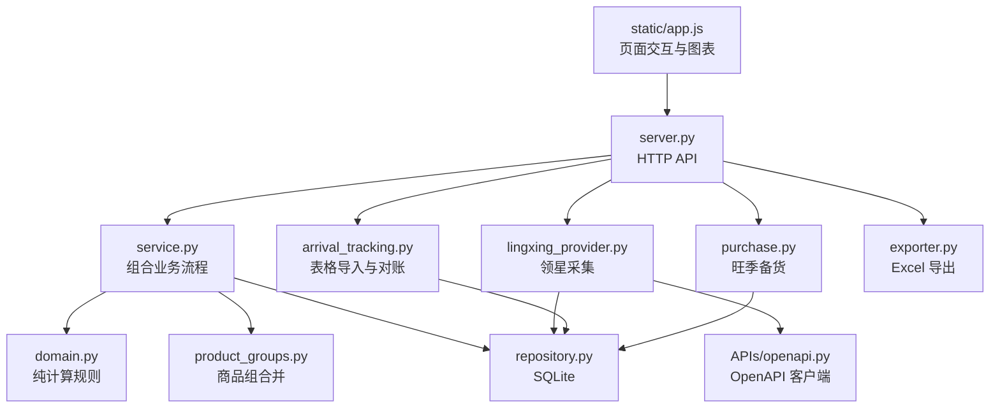
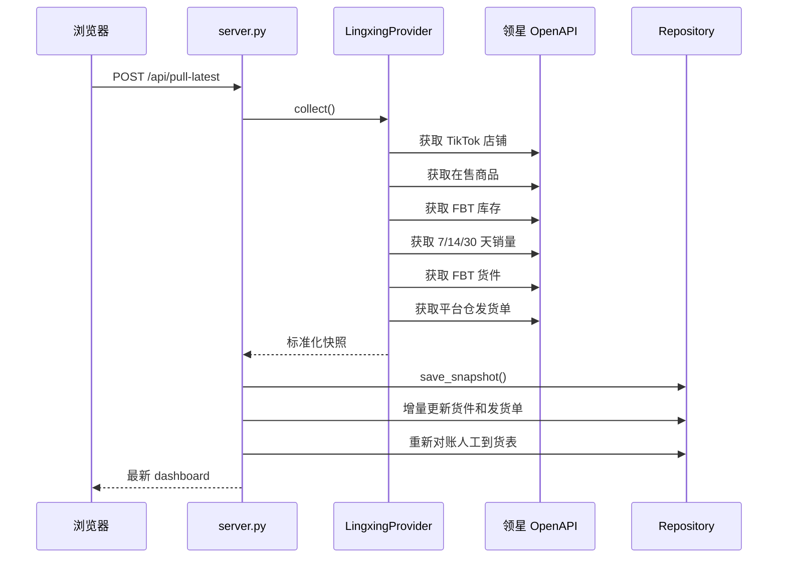

# TK 发货与旺季备货决策台：代码架构说明

## 1. 技术栈

- Python 标准库 HTTP 服务；
- SQLite 本地数据库；
- 领星 OpenAPI 异步客户端；
- 原生 HTML、CSS、JavaScript；
- ECharts 库存预测图；
- Lucide 图标；
- openpyxl 负责 Excel 导入和导出；
- pytest 自动化测试。

项目没有前端构建步骤，也不依赖 Node.js。静态库已放在仓库中，可离线加载。

## 2. 目录结构

```text
项目库存1/
├─ run_webapp.py                 # 启动入口
├─ 启动TK补货决策台.cmd           # Windows 双击启动
├─ requirements.txt             # Python 依赖
├─ README.md                    # GitHub 项目首页
├─ docs/
│  ├─ 业务逻辑说明.md
│  └─ 代码架构说明.md
├─ APIs/
│  ├─ openapi.py                # 领星 OpenAPI 客户端
│  ├─ http_util.py              # HTTP 请求封装
│  ├─ sign.py                   # 请求签名
│  ├─ aes.py                    # 加密工具
│  ├─ resp_schema.py            # 接口响应模型
│  └─ tests/                    # OpenAPI 客户端测试
└─ webapp/
   ├─ server.py                 # HTTP 路由与静态文件服务
   ├─ lingxing_provider.py      # 领星数据采集与标准化
   ├─ repository.py             # SQLite 表结构和持久化
   ├─ product_groups.py         # -US 商品组合并
   ├─ service.py                # 业务编排层
   ├─ domain.py                 # 发货计算和库存预测核心
   ├─ purchase.py               # 旺季供应商备货
   ├─ arrival_tracking.py       # 到货表解析与 SKU 对账
   ├─ exporter.py               # 三类 Excel 导出
   ├─ static/
   │  ├─ index.html             # 页面结构
   │  ├─ app.js                 # 页面状态、请求和交互
   │  ├─ styles.css             # 页面样式
   │  └─ vendor/                # ECharts、Lucide
   ├─ data/                     # 本地 SQLite，Git 忽略
   └─ tests/                    # 业务自动化测试
```

## 3. 分层职责



原则：

- `domain.py` 不直接读数据库或调用网络，只接收字典并返回计算结果，便于测试。
- `repository.py` 只负责数据持久化和基础校验。
- `service.py` 把快照、设置、时间表、复核结果和 IBR 组装成计算输入。
- `server.py` 负责参数解析、错误转换和 HTTP 响应，不复制核心公式。

## 4. 一次“拉取领星数据”的调用链



### 4.1 领星接口

`webapp/lingxing_provider.py` 当前使用：

| 用途 | API Path |
|---|---|
| TikTok 店铺 | `/pb/mp/shop/v2/getSellerList` |
| TikTok 在线商品 | `/basicOpen/multiplatform/tiktok/list` |
| FBT 库存 | `/basicOpen/multiplatform/fbt/stockSearch/v2` |
| 多平台销售统计 | `/basicOpen/platformStatisticsV2/saleStat/pageList` |
| FBT 货件列表 | `/basicOpen/fbtShipment/cargo/list` |
| 平台仓发货单 | `/basicOpen/multiplatform/query/shippingList` |

销售查询分别运行 7、14、30 天三个窗口，结束日期是运行日前一天。

### 4.2 数据标准化

领星字段在 Provider 层转换为统一字段：

```text
商品：
store_id, msku, sku, product_name, image_url,
sales_7, sales_14, sales_30,
avg_7, avg_14, avg_30,
fbt_total, fbt_sellable, fbt_in_transit

货件：
cargo_code, store_id, status, delivery_time,
expected_delivery_time, items

发货单：
shipping_list_code, logistics_provider,
logistics_channel, tracking_numbers,
arrival_time, expected_arrival_time
```

## 5. Dashboard 构建流程

入口：`webapp/service.py::build_dashboard`

执行顺序：

1. 读取最近一份领星原始快照；
2. 确定计算日期；
3. 读取参数、旺季时间表、当前计划周人工复核；
4. 读取产品状态和商品组设置；
5. 构建货件视图；
6. 生成按商品组索引的有效 IBR；
7. 合并同店铺 `-US` 商品；
8. 每个商品组调用一次 `calculate_recommendation`；
9. 按风险、断货日和销量排序；
10. 计算首页汇总。

核心入口：

```python
calculate_recommendation(
    product,
    settings,
    schedule,
    current_date,
    decision,
    inbounds,
)
```

## 6. 核心计算模块 `domain.py`

### 6.1 默认配置

`DEFAULT_SETTINGS` 保存：

- 五条渠道启停状态；
- 时效计算模式；
- 各渠道最短/最长时效；
- 海运截单和开船星期；
- 各渠道安全天数和发货频率；
- 动态日均权重；
- 停止收货日；
- 风险提示阈值。

`DEFAULT_SCHEDULE` 保存每周旺季基础覆盖天数。

数据库中已有配置会覆盖默认值。

### 6.2 关键函数

| 函数 | 作用 |
|---|---|
| `dynamic_daily_sales` | 按权重计算动态日均 |
| `build_channel_plans` | 计算每条渠道最终预计入仓日 |
| `schedule_context` | 确定上一周、本周和下一周计划 |
| `_prepare_inbounds` | 清理、标记并缩放有效 IBR |
| `_receipts_by_day` | 汇总目标窗口内会入仓的 IBR |
| `_first_stockout` | 按日模拟首次断货日 |
| `_required_bridge_qty` | 算较早渠道撑到下一渠道的桥接量 |
| `_optimize_inventory_balance` | 以人工固定量为约束，按日求解不断货且尽量少发的其余节点数量 |
| `recalculate_scenario_plan` | 规范化人工节点、生成必要接力候选并调用统一库存平衡求解器 |
| `calculate_recommendation` | 计算单个商品组的完整建议 |
| `build_forecast` | 生成蓝线、橙线、节点和辅助线 |
| `build_summary` | 汇总 SKU 数、建议量和风险分布 |

### 6.3 分配算法的数据结构

每条 `channel_plan` 包含：

```text
key / label
enabled
transit_min_days / transit_max_days
cutoff_date / sailing_date
base_arrival_date
planning_arrival_date
planning_arrival_days
safety_days / frequency_days
recommended_qty
eligible_before_cutoff
```

`planning_arrival_date` 是所有计算、分发、图表和导出的统一到货口径。

人工情景节点保存在 `decisions.scenario_nodes` JSON 字段中。同一渠道可以出现多条记录，每条记录分别保存发货日、预计入仓日、数量、`quantity_locked` 和 `auto_generated`；原有 `confirmed_*_qty` 字段继续保存按渠道汇总后的数量，兼容首页汇总和 Excel 导出。

### 6.4 计算结果

单个商品结果除原始字段外，还包括：

```text
dynamic_daily
sellable_coverage_days
stockout_date
normal_target_units
current_target_units
next_target_units
base_normal_qty
current_gap
next_buy_gap
express_qty / air_qty / quick_qty / truck_qty / slow_qty
planned_ship_total
bridge_details
channel_plans
risk / risk_rank
data_flags / data_notes
```

## 7. 商品组合并 `product_groups.py`

### 7.1 组合键

```python
(store_id, remove_terminal_us_suffix(msku).upper())
```

只移除结尾的 `-US`，不会删除 MSKU 中间的 `US`，也不会跨店铺合并。

### 7.2 合并策略

销量、日均、库存字段求和；商品图片、名称和平台 SKU 使用执行成员的值。

如果同一商品组的成员平台 SKU 不一致，结果会标记 `group_sku_conflict`，方便后续人工检查。

### 7.3 兼容旧记录

以下旧记录会在商品组层面统一读取：

- 人工复核；
- 产品清仓/下架状态；
- IBR；
- 备货聚合。

因此合并前保存过的 `CJX0265-4` 决策不会因为当前执行 MSKU 变成 `CJX0265-4-US` 而完全丢失。

## 8. 到货台账 `arrival_tracking.py`

职责：

- 解析旧版到货跟踪格式；
- 解析系统自己导出的格式；
- 按文件哈希去重；
- 提取 IBR、SKU、日期、数量和跟踪字段；
- 自动匹配商品；
- 保存未匹配和冲突记录；
- 使用人工别名重新对账。

匹配逻辑坚持“唯一才自动匹配”。如果一个原始 SKU 对应多个候选商品，系统保留冲突，不根据名称猜测。

## 9. 数据库 `repository.py`

SQLite 文件默认位置：

```text
webapp/data/tk_replenishment.db
```

主要表：

| 表 | 用途 |
|---|---|
| `raw_snapshots` | 领星原始快照 |
| `settings` | 全局参数 |
| `season_schedule` | 旺季周计划 |
| `decisions` | 每周人工复核 |
| `purchase_plan_configs` | 备货已完成月份 |
| `purchase_plan_overrides` | 备货人工调整 |
| `shipment_records` | FBT 货件主表 |
| `shipment_items` | 货件商品明细 |
| `shipping_orders` | 发货单及物流信息 |
| `shipment_overrides` | 人工跟踪号和日期 |
| `arrival_imports` | 到货表导入批次 |
| `arrival_batches` | 到货跟踪主记录 |
| `arrival_items` | 到货表商品明细 |
| `product_aliases` | 人工确认的 SKU 别名 |
| `product_planning_statuses` | 正常/清仓/下架 |
| `product_group_settings` | 商品组执行 MSKU |

数据库初始化采用 `CREATE TABLE IF NOT EXISTS` 和必要的增量字段迁移，旧数据库可直接升级。

## 10. HTTP API

### 10.1 查询接口

| 方法 | 路径 | 用途 |
|---|---|---|
| GET | `/api/health` | 健康检查 |
| GET | `/api/dashboard` | 首页和商品列表 |
| GET | `/api/product` | 商品详情与库存预测 |
| GET | `/api/settings` | 参数和旺季时间表 |
| GET | `/api/shipments` | IBR 到货台账 |
| GET | `/api/purchase-plan` | 旺季备货计划 |
| GET | `/api/export` | 导出发货建议 |
| GET | `/api/purchase-plan/export` | 导出备货表 |
| GET | `/api/arrival-tracking/export` | 导出到货跟踪 |

### 10.2 写入接口

| 方法 | 路径 | 用途 |
|---|---|---|
| POST | `/api/pull-latest` | 拉取领星并保存快照 |
| POST | `/api/settings` | 保存参数 |
| POST | `/api/schedule` | 保存旺季时间表 |
| POST | `/api/decision` | 保存人工复核 |
| POST | `/api/purchase-plan` | 保存备货调整 |
| POST | `/api/scenario` | 按人工发货节点重新计算总量和渠道接力 |
| POST | `/api/arrival-tracking/import` | 导入到货表 |
| POST | `/api/shipment-override` | 人工补充物流信息 |
| POST | `/api/product-alias` | 保存 SKU 对账别名 |
| POST | `/api/product-status` | 保存产品状态 |
| POST | `/api/product-group` | 指定商品组执行 MSKU |

## 11. 前端 `static/`

`index.html` 定义：

- 首页决策台；
- 库存预测图与商品详情抽屉；
- 参数设置；
- IBR 到货台账；
- 备货采购；
- 产品状态页面。

`app.js` 负责：

- 调用所有 HTTP API；
- 保存页面状态和筛选条件；
- 渲染商品表、汇总卡片和风险标签；
- 渲染 ECharts 库存预测；
- 人工修改某一批次数量时将其锁定，并由后端重新优化其他批次后刷新橙线；
- 新增、删除和修改多次发货节点，并调用后端重算分配；
- 动态生成启用渠道列；
- 到货表导入、对账和导出；
- 商品组成员及执行 MSKU 管理。

`styles.css` 负责响应式布局。详情抽屉使用大尺寸模式，桌面和窄屏均避免图表与标签重叠。

## 12. Excel 导出 `exporter.py`

### 12.1 发货建议

`build_export` 根据当前启用渠道动态生成两组列：

```text
渠道覆盖天数
渠道建议补货
```

清仓和下架商品不会进入导出。

### 12.2 旺季备货

`build_purchase_export` 输出供应商需要的三列简表。

### 12.3 到货跟踪

`build_arrival_tracking_export` 输出可再次导入的工作簿，并携带系统标识和对账明细。

## 13. 自动化测试

测试覆盖：

| 文件 | 覆盖范围 |
|---|---|
| `test_domain.py` | 动态日均、时效、断货、渠道桥接、停止收货日、人工复核 |
| `test_product_groups.py` | `-US` 合并、跨店隔离、执行 MSKU、IBR 和导出 |
| `test_arrival_tracking.py` | 表格解析、匹配、去重、日期 |
| `test_repository.py` | SQLite 保存与读取 |
| `test_purchase.py` | 旺季等效天数和人工调整 |
| `test_shipping_export.py` | 动态渠道列和导出内容 |
| `APIs/tests/` | OpenAPI 签名、响应和异常处理 |

运行：

```powershell
python -m pytest webapp/tests APIs/tests
```

## 14. 配置和密钥

应用优先从系统环境读取：

```text
LINGXING_APP_ID
LINGXING_APP_SECRET
```

仓库中的 `.env.example` 只展示变量名称，不包含真实值。当前代码不会自动加载 `.env` 文件，启动前应在系统或 PowerShell 中设置环境变量。

历史工作站上可能存在带硬编码密钥的旧脚本，它们已被 `.gitignore` 明确排除，不能作为新环境的配置方式。

## 15. 扩展代码时的约定

### 新增物流渠道

需要同步修改：

1. `domain.DEFAULT_SETTINGS`；
2. `CHANNEL_KEYS` 和渠道分类；
3. `build_channel_plans`；
4. `calculate_recommendation` 的数量字段；
5. 数据库人工复核字段；
6. 前端设置卡片和复核控件；
7. 导出与测试。

渠道数量已经部分数据驱动，但人工复核数据库字段仍是显式列，因此不能只改前端。

### 新增数据源

应先在 Provider 层转换为现有标准字段，再进入 Repository；不要把领星原始字段直接传给 `domain.py`。

### 修改公式

优先修改 `domain.py` 的纯函数，并先补充 `test_domain.py`。页面图表应继续复用同一份 `channel_plans` 和数量结果，避免表格、导出、图表出现三套口径。

## 16. 已知限制与后续方向

- 当前 HTTP 服务是单机内部工具，没有用户权限和操作审计账号。
- SQLite 适合当前单机规模；多人同时写入时应升级为正式服务数据库。
- 销量只有聚合窗口，没有逐日断货校正。
- IBR 日期依赖领星或人工表，没有承运商官网自动追踪。
- 采购页尚未建立采购单和已买数量闭环。
- 渠道成本目前不参与优化，算法只按时效和库存安全分配。
- 旧源码中的部分中文字符串曾受历史编码影响；业务页面当前可用，但后续应统一清理为 UTF-8 中文常量。
